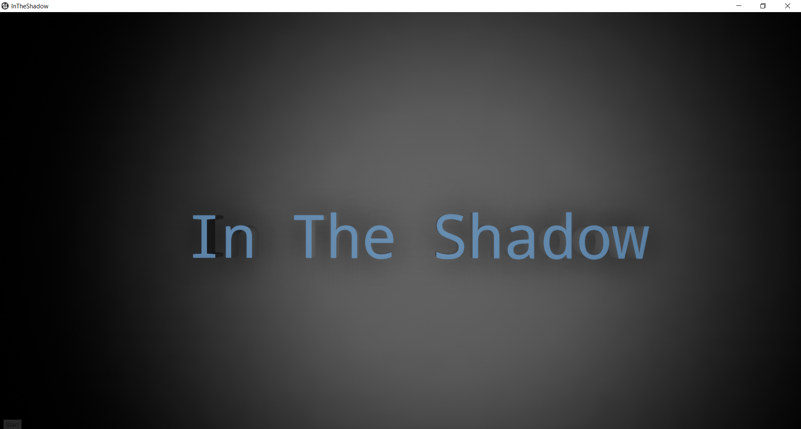
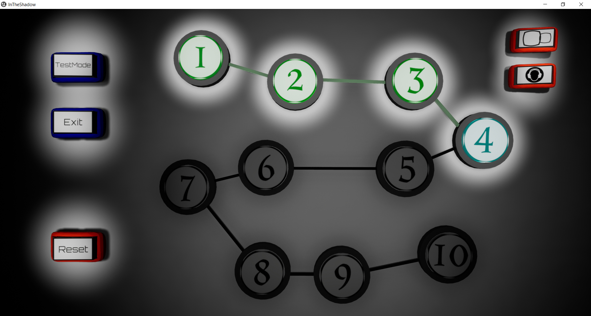
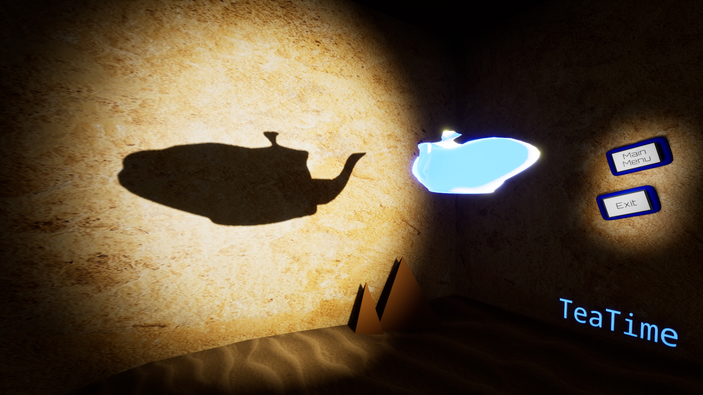
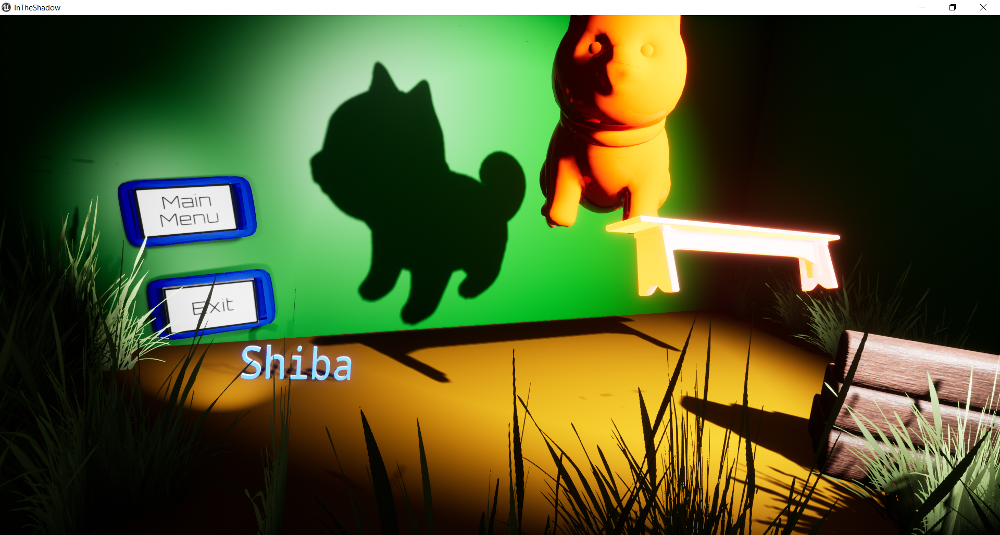
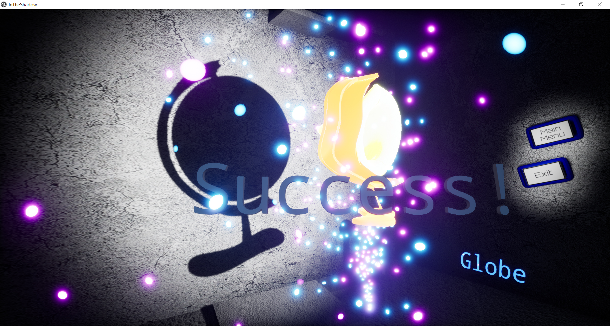
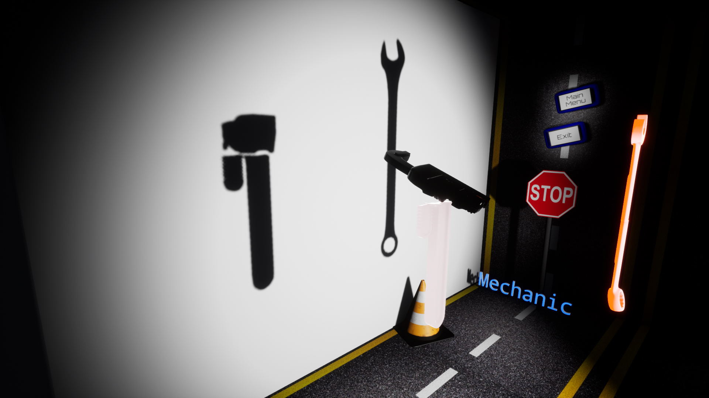
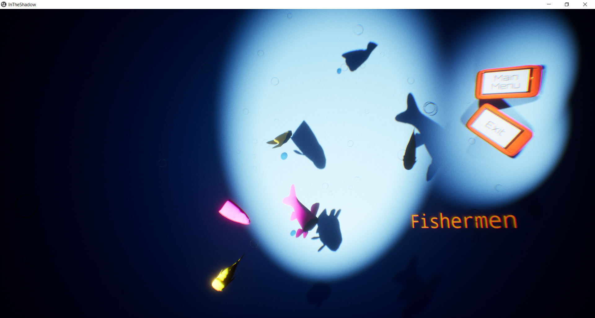

# InTheShadow

The goal of the project: to develop a game close to Shadowmatic.  
The goal of the game: the player must use an object in the foreground to create a shadow that looks like a familiar shape in the background.  
The game’s website: http://www.shadowmatic.com/

__NOTE:__
The aim of this project is to implement a simple game from A to Z using a game engine.
The game design is not too complex, but it requires a little creativity.
A test mode will take the player on a path where all the puzzles are unlocked.
The game must be played with a mouse only.
To differentiate the rotation and the movement, you can combine the mouse click with a keyboard key.
The shadow validation management must be neither too demanding, nor too permissive.
Objects must move smoothly.

__Realized options:__
- Beauty: Textures, Decoration, 3D menu
- Creativity: More levels than required
- Immersion: Different soundtracks and effects

  

Instructions:
- Project tested on Ubuntu and Xubuntu
- Open a terminal in the project root and compile the program with the command "make" (all dependencies will be downloaded)
- Usage: ./nibbler [width] [height] [libIDX] [optional: -flag]

__Credits:__
- https://www.bensound.com/
- https://mixkit.co/
- Shiba is Bad Guy by grigoriyarx is licensed under Creative Commons Attribution (https://sketchfab.com/3d-models/shiba-is-bad-guy-89839b90afa6452cb333107f09367075)
- Fishes by Costr (Viverna) is licensed under Creative Commons Attribution (https://sketchfab.com/3d-models/fishes-aa31604aa3d446b59775dd9e5a08a9ce#download)
- Cushion Sea Star by RISD Nature Lab is licensed under Creative Commons Attribution (https://sketchfab.com/3d-models/cushion-sea-star-dbcc468ad62949529bd8031b06434765#download)
- Low Poly Old Red Painted Wooden Bench by Kaamalauppias is licensed under Creative Commons Attribution (https://sketchfab.com/3d-models/low-poly-old-red-painted-wooden-bench-0c0fd2ba8ba64d7987f7607be22b8ec4#download)

_For this project I decided to make all files public but please do not hesitate to contact me if need additional details._
